# Clinical Trial Agentic Platform 🧬

[](https://www.python.org/downloads/release/python-3120/)
[](https://fastapi.tiangolo.com/)
[](https://modelcontextprotocol.io/)
[](https://langchain-ai.github.io/langgraph/)
[](https://www.keycloak.org/)
[](https://openfga.dev/)

A secure, agentic platform for clinical trial data analysis that combines **LLM-powered reasoning** with a **multi-modal Data Mesh** (Relational + Graph + Vector) and **fine-grained authorization** (Keycloak + OpenFGA). Researchers ask natural language questions; the system autonomously selects tools, queries authorized data, and synthesizes clinically precise answers — all while enforcing the **Access Level Ceiling Principle** to prevent data leakage.

---

## Table of Contents

1. [For End Users](#-for-end-users)
2. [For Architects](#-for-architects)
3. [High-Level Architecture](#-high-level-architecture)
4. [Architecture Patterns & Best Practices](#-architecture-patterns--best-practices)
5. [Synthetic Data Generation](#-synthetic-data-generation)
6. [Data Ingestion Pipeline](#-data-ingestion-pipeline)
7. [Security Architecture & Access Control](#-security-architecture--access-control)
8. [The Access Level Ceiling Principle](#-the-access-level-ceiling-principle)
9. [MCP Server — Tool Hub](#-mcp-server--tool-hub)
10. [Agentic Reasoning — LangGraph ReAct](#-agentic-reasoning--langgraph-react)
11. [Token Efficiency](#-token-efficiency)
12. [Frontend — React + Keycloak SPA](#-frontend--react--keycloak-spa)
13. [Evaluation Framework](#-evaluation-framework)
14. [Project Structure](#-project-structure)
15. [Getting Started](#-getting-started)
16. [Common Commands](#-common-commands)
17. [Dashboards & Exploration](#-dashboards--exploration)
18. [Testing & Validation](#-testing--validation)
19. [Topics Covered](#-topics-covered)

---

## 👥 For End Users

This platform lets researchers ask clinical trial questions in natural language and receive authorized, evidence-based answers across relational, graph, and vector data.

### Who Uses It

- **Researchers**: ask questions, compare trial outcomes, inspect authorized patient-level details
- **Managers**: approve access, assign researchers, manage cohorts
- **Domain Owners**: publish collections and govern access boundaries

### What You Can Do

1. Sign in with your enterprise account (Keycloak SSO)
2. Open your role-specific dashboard
3. Ask questions such as:
  - "Compare adverse event rates across my assigned oncology trials"
  - "Show lab trends for patients over 65 in Trial NCT..."
4. Review tool-backed answers with cited trial identifiers
5. Iterate with follow-up questions in the same context

### What to Expect in Responses

- **Authorization-aware outputs**: only data you are allowed to see
- **Ceiling principle protection**: mixed-access queries are automatically downgraded to aggregate-only
- **Clinically structured answers**: counts, rates, cohorts, and terminology aligned to clinical coding systems

### End User Best Practices

- Be specific: include trial IDs, therapeutic area, time windows, or patient criteria
- Ask one analytical objective per question when possible
- For comparisons, explicitly name the comparison axis (trial, drug, cohort, time)
- If a result is empty, broaden filters (date range, criteria strictness, trial scope)

---

## 🏛️ For Architects

This section summarizes the architectural intent so solution and platform teams can evolve the system consistently.

### Architecture Principles

1. **Security by default**: fail-closed authorization and strict identity enforcement
2. **Least privilege access**: enforce trial-level and cohort-level constraints end-to-end
3. **Data product thinking**: relational, graph, and vector stores exposed as governed products via MCP
4. **Separation of concerns**: ingestion, serving, authorization, and reasoning are independent services
5. **Event-driven decoupling**: generation and ingestion communicate via Kafka events, not direct writes
6. **Observable systems**: traces, metrics, and evaluations are first-class runtime capabilities
7. **Deterministic safety rails**: guardrails and ceiling principle override unsafe model behavior
8. **Evolution without lock-in**: modular tool interfaces allow adding new data capabilities without breaking clients

### Architecture Patterns

| Pattern | Applied In | Why It Matters |
|:---|:---|:---|
| **Data Mesh** | PG + Neo4j + Qdrant via MCP tools | Domain-aligned ownership and independent scaling |
| **Claim-Check** | MinIO + Kafka events | Prevents oversized broker payloads |
| **Idempotent Producer / Consumer** | Kafka producer and processor flows | Reduces duplicate side effects in retries |
| **ReAct Tool Orchestration** | LangGraph agent loop | Separates reasoning from data retrieval actions |
| **Fail-Closed Authorization** | OpenFGA integration | Prevents data leakage during dependency failures |
| **Two-Layer Access Control** | OpenFGA + SQL cohort filters | Enables trial and patient granularity |
| **Semantic Layer Separation** | Dedicated Semantic MCP + inline semantic context | Decouples ontology governance from data serving |

### Architectural Best Practices

- Keep MCP tools narrow, composable, and explicit about contracts
- Treat authorization context as mandatory input to every data tool
- Preserve backward compatibility for tool schemas and response envelopes
- Validate model behavior continuously with offline and production evaluation loops
- Version ontology and semantic mappings independently from application releases
- Use service-level health checks and startup probes for all stateful dependencies
- Prefer asynchronous boundaries for heavy ingestion and enrichment workloads

---

## 🏗️ High-Level Architecture

The platform follows a **microservices architecture** coordinated via Docker Compose. Every service runs in an isolated container, communicating over a shared Docker network (`clinical-net`).

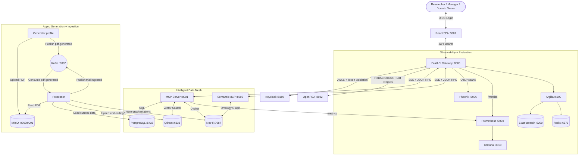

### Component Summary

| Service | Role | Port |
|:---|:---|:---|
| **Frontend** | React SPA with Keycloak SSO, chat UI, role-based dashboards | `3001` |
| **API Gateway** | FastAPI — orchestrates LangGraph agent, computes access profiles | `8000` |
| **MCP Server** | FastMCP — 15 clinical tools exposed via SSE/JSON-RPC | `8001` |
| **Semantic MCP Server** | Ontology/concept disambiguation service used by API agent | `8002` |
| **Keycloak** | OIDC Identity Provider — JWT issuance, realm roles, PKCE | `8180` |
| **OpenFGA** | Zanzibar-style ReBAC engine — trial/patient/cohort tuples | `8082` |
| **PostgreSQL** | Relational store — trials, patients, labs, AEs, auth tables | `5432` |
| **Neo4j** | Knowledge graph — Drug→Condition, Patient→AE, comorbidities | `7474` |
| **Qdrant** | Vector DB — `text-embedding-3-large` (3072-dim) embeddings | `6333` |
| **Kafka** | Event bus — `pdf-generated`, `trial-ingested` topics | `9092` |
| **MinIO** | S3-compatible object store for generated PDF reports | `9001` |
| **Phoenix** | OTLP trace collector for LLM/Agent spans | `6006` |
| **Prometheus** | Metrics scraping from API + MCP + evaluation framework | `9090` |
| **Grafana** | Dashboards — Agent Performance + Semantic Layer Quality | `3010` |
| **Argilla** | Human-in-the-loop evaluation review | `6900` |
| **Elasticsearch** | Backend store for Argilla annotations | `9200` |
| **Redis** | Cache/queue backend for Argilla | `6379` |

---

## 📈 ABAC Fallback Monitoring

The agent now emits `agent_abac_context_fallback_total`, which counts cases where
`AgentService` had to derive partial ABAC context because router-provided
`abac_context` was missing.

### PromQL Snippets

- Fallback events in last hour:

```promql
increase(agent_abac_context_fallback_total[1h])
```

- Fallback rate per minute:

```promql
rate(agent_abac_context_fallback_total[5m]) * 60
```

- Share of queries impacted (10m window):

```promql
increase(agent_abac_context_fallback_total[10m])
/
clamp_min(increase(agent_query_total[10m]), 1)
```

### Recommended Alert Thresholds

- `warning`: any fallback detected over 10 minutes (`> 0`)
- `critical`: sustained fallback burst over 30 minutes (`>= 5`)

These alerts are provisioned in:
`observability/prometheus/alerts/agent-alerts.yml`

---

## 🧩 Architecture Patterns & Best Practices

### Data Mesh

Each data domain (Relational, Graph, Vector) is treated as an independent product with its own access surface. The MCP Server acts as the **data product API**, exposing tools that abstract away the underlying store.

### Event-Driven Architecture (EDA)

The Generator and Processor communicate exclusively via Kafka events. The Generator never writes to databases directly — it publishes a lightweight `PDFGeneratedEvent` to Kafka with a reference to the PDF stored in MinIO. This decouples generation from ingestion and allows horizontal scaling.

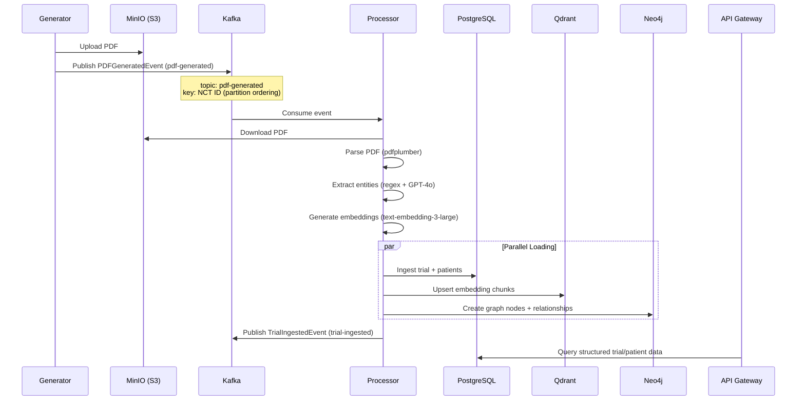

### Idempotent Producer

The Kafka producer is configured with `enable.idempotence=True`, `acks=all`, and `max.in.flight.requests.per.connection=1` to guarantee exactly-once delivery semantics. Messages are LZ4-compressed for efficiency.

### Claim-Check Pattern

Large PDF payloads are stored in MinIO (the "claim"), and only a lightweight reference (`bucket` + `object_key`) is published to Kafka (the "check"). This keeps Kafka messages under 1MB and avoids broker memory pressure.

### ReAct (Reason + Act) Loop

The LangGraph agent follows the ReAct pattern: at each step, the LLM either (a) selects a tool to call, or (b) outputs a final answer. The loop continues until the LLM has enough data to synthesize a response.

### Fail-Closed Security

The OpenFGA client defaults to `FAIL_CLOSED=true`: if the authorization service is unreachable, all access checks return `denied`. This prevents accidental data exposure during infrastructure outages.

### Two-Layer Access Control

- **Layer 1 (OpenFGA)**: Which trials can the user access? (binary gate)
- **Layer 2 (PostgreSQL)**: Which patients within those trials? (cohort filters)

The `AccessProfile` carries both layers through the entire pipeline.

### Hybrid Entity Extraction

The Processor uses a three-stage extraction pipeline:
1. **Regex-based** for structured fields (NCT IDs, LOINC codes, dates)
2. **Table parsing** with robust classification (conditions vs. labs vs. AEs)
3. **LLM-assisted** (`GPT-4o`) for unstructured narrative sections

---

## 🧪 Synthetic Data Generation

The Generator service creates realistic clinical trial data using `Faker` and domain-specific medical reference tables. All data is reproducible via a configurable seed.

### Therapeutic Areas & Reference Data

The generator ships with curated medical data across **3 therapeutic areas**:

| Area | Conditions | Drugs | Lab Tests | Adverse Events |
|:---|:---|:---|:---|:---|
| **Oncology** | NSCLC, Breast Cancer, Melanoma, Colorectal, Pancreatic | Pembrolizumab, Nivolumab, Atezolizumab, Paclitaxel | WBC, ANC, Hemoglobin, Platelets, ALT, AST, Creatinine, TSH | Nausea, Neutropenia, Pneumonitis, Hepatitis |
| **Cardiology** | Heart Failure, AFib, Hypertension, ACS | Sacubitril/Valsartan, Empagliflozin, Apixaban | BNP, Troponin I, Potassium, eGFR, INR | Hypotension, Bleeding, Hyperkalemia |
| **Endocrinology** | T2DM, T1DM, Obesity, Diabetic Nephropathy | Semaglutide, Tirzepatide, Metformin | HbA1c, Fasting Glucose, Lipase | Hypoglycemia, Pancreatitis |

All entries include **medical coding**: ICD-10, MeSH, SNOMED CT, RxNorm, LOINC, MedDRA PT/SOC.

### What Gets Generated Per Trial

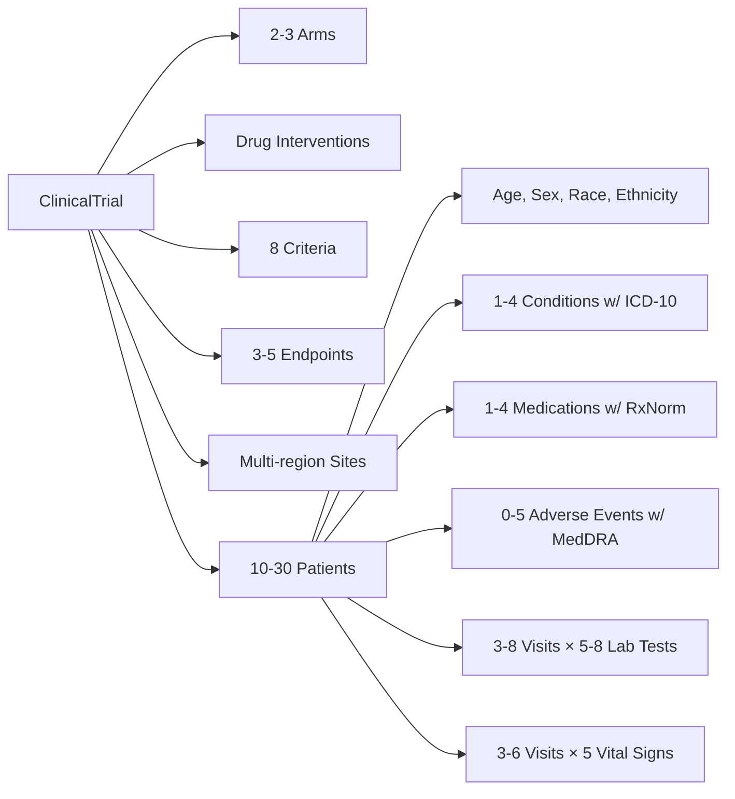

### Generated PDF Format

Each trial produces a multi-page PDF built with **ReportLab** that mimics a real ClinicalTrials.gov protocol document:

1. **Title Page**: NCT ID, sponsor, phase, status, therapeutic area, confidentiality notice
2. **Study Identification**: NCT number, sponsor ID, titles, collaborators
3. **Study Overview**: Brief summary, detailed description (LLM-parseable narratives)
4. **Study Design**: Phase, allocation, masking, intervention model, primary purpose
5. **Arms & Interventions**: Treatment vs. placebo arms, dosage, route, frequency, RxNorm codes
6. **Eligibility Criteria**: Numbered inclusion/exclusion criteria
7. **Outcome Measures**: Primary and secondary endpoints with time frames
8. **Study Locations**: Multi-region facility table
9. **Patient Data Summary**: Aggregate demographic statistics
10. **Individual Case Reports**: First 5 patients with full detail (demographics, conditions, medications, AEs, labs)
11. **Summary Table**: Remaining patients in a compact tabular format

### Lab Value Realism

Lab results follow Gaussian distributions centered on the normal range, with a **15% probability of abnormal values**. Each result carries an abnormal flag (`H`/`L`/`N`) computed against reference ranges.

---

## 🔄 Data Ingestion Pipeline

The Processor is a long-lived Kafka consumer that converts raw PDFs into structured, searchable data across all three stores.

### Pipeline Steps

```text
Download PDF (MinIO) → Parse (pdfplumber) → Extract (Regex + LLM) → Embed (OpenAI) → Load (PG + Qdrant + Neo4j)
```

### Embedding Strategy

The `ClinicalTrialEmbeddingGenerator` creates multiple chunk types per trial:

| Chunk Type | Content | Use Case |
|:---|:---|:---|
| `trial_summary` | Title, phase, condition, sponsor, brief summary | "Find trials for NSCLC" |
| `trial_design` | Study type, allocation, masking, model | "Which trials are double-blind?" |
| `eligibility_criterion` | One criterion per chunk | "Trials accepting patients over 65" |
| `intervention` | Drug name, dose, route, RxNorm code | "Trials using Pembrolizumab" |
| `outcome_measures` | All endpoints concatenated | "Trials measuring PFS" |
| `patient_narrative` | Natural language patient summary | "Patients with severe neutropenia" |
| `serious_adverse_event` | Individual SAE detail with MedDRA | "Serious hepatitis events" |

**Model**: `text-embedding-3-large` — **3072 dimensions** — with validation that every embedding matches the expected dimensionality before upserting to Qdrant.

### Neo4j Knowledge Graph Schema

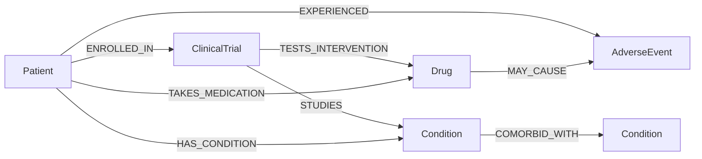

**Node Types**: `ClinicalTrial`, `Patient`, `Drug` (RxNorm), `Condition` (ICD-10), `AdverseEvent` (MedDRA), `LabTest` (LOINC)

**Uniqueness Constraints**: `trial_id`, `nct_id`, `patient_id`, `icd10_code`, `rxnorm_code`, `meddra_pt`, `loinc_code`

---


---

## 🔐 Security Architecture & Access Control

The platform follows a **"Defense in Depth"** strategy, ensuring that sensitive clinical data is protected at every layer, from the user's initial login to the final SQL execution.

### 1. Identity & Authentication (Keycloak OIDC)
Keycloak serves as the **OpenID Connect (OIDC) Identity Provider**. It issues **RS256-signed JWTs** that carry user identity, roles, and custom claims.

#### Token Issuance Flow
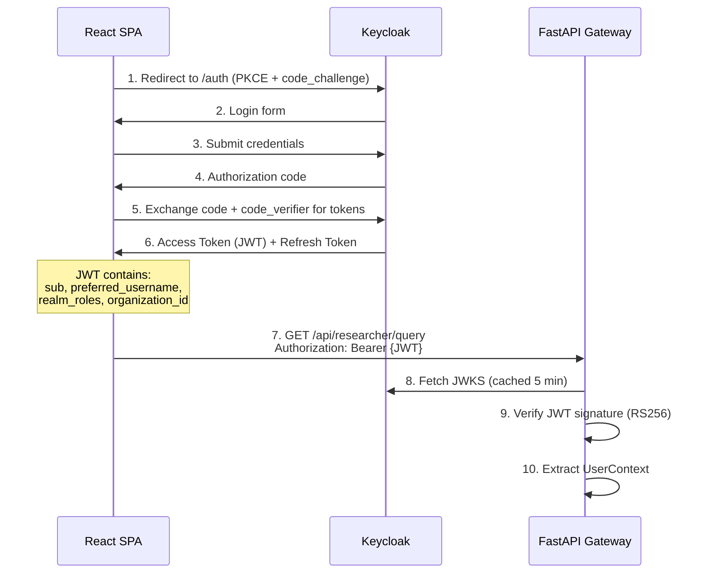

#### JWT Claims Used
| Claim | Source | Purpose |
|:---|:---|:---|
| `sub` | Keycloak standard | User ID (UUID) |
| `preferred_username` | Keycloak standard | Display name |
| `realm_access.roles` | Keycloak realm roles | Role determination (`domain_owner` > `manager` > `researcher`) |
| `organization_id` | Custom attribute mapper | Organization scoping for multi-tenancy |
| `clearance_level` | Custom attribute mapper | Classification-based ABAC gating |

---

### 2. Fine-Grained Authorization (OpenFGA ReBAC)
OpenFGA implements **Google Zanzibar-style Relationship-Based Access Control (ReBAC)**. It answers questions like "Can user X view individual data for trial Y?" by evaluating a graph of relationship tuples.

#### Authorization Model
```text
type user

type organization
  relations
    define member: [user]
    define manager: [user] and member
    define domain_owner: [user]

type clinical_trial
  relations
    define owner: [user]                               # Domain owner who published
    define granted_org: [organization with check_fine_grained_access]
    define assigned_researcher: [user with check_fine_grained_access]
    define can_view_aggregate: member from granted_org  # COMPUTED
    define can_view_individual: assigned_researcher or owner  # COMPUTED

type patient
  relations
    define enrolled_in_trial: [clinical_trial]
    define can_view_individual: can_view_individual from enrolled_in_trial  # DERIVED
```

#### Conditional Access
Access is often gated by **Conditions (CEL)**, such as validity windows, approved regions, or specific query purposes. These are written as conditional tuples in OpenFGA and evaluated at runtime using request-specific attributes.

---

### 3. The Access Context Lifecycle
The most critical security component is the **Access Context**—a secure, immutable payload that travels with every agent request. It transforms abstract permissions into concrete database filters.

#### Phase A: Generation (Compute)
At the start of every query, the API Gateway's `AuthorizationService` computes the user's **Access Profile**:
1.  **OpenFGA Discovery**: The service calls OpenFGA's `ListObjects` to find all trials the user can access at either the **Aggregate** or **Individual** level.
2.  **DB Enrichment**: It then fetches specific **Cohort Filters** (JSONB criteria) from PostgreSQL for those trials (e.g., `{"age_min": 18, "region": "EU"}`).
3.  **Serialization**: These permissions are bundled into a serialized JSON object—the `access_context`.

#### Phase B: Enforcement (Enforce)
The Agent (LLM) cannot see or modify the `access_context`. When the Agent calls an MCP tool:
1.  **Context Injection**: The API Gateway intercepts the tool call and **injects** the `access_context` into the tool arguments.
2.  **Validation**: The MCP Server deserializes the context and verifies that the requested `trial_id` is actually in the `allowed_trial_ids` list.
3.  **SQL Generation**: The `AccessContext` class translates the context into **parameterized SQL WHERE clauses** (e.g., `WHERE trial_id = '...' AND p.age >= 18`). This ensures the database driver physically cannot retrieve unauthorized rows.

#### Access Evaluation Flow
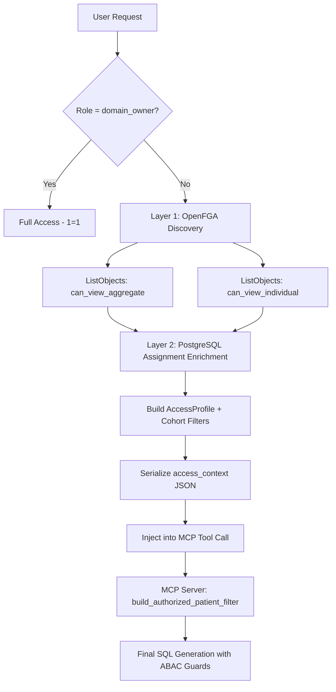

---

### 4. Summary Table: Security Layers

| Layer | Component | Mechanism | Security Guarantee |
| :--- | :--- | :--- | :--- |
| **Authentication** | Keycloak | OIDC / JWT / PKCE | Verifies "Who are you?" using enterprise identity. |
| **Authorization** | OpenFGA | ReBAC / ABAC / CEL | Verifies "What can you see?" based on relationships. |
| **Orchestration** | API Gateway | Context Injection | Ensures the LLM is bounded by real-time permissions. |
| **Data Serving** | MCP Server | Dynamic SQL Filtering | Prevents data leakage at the source (PostgreSQL). |

---

### Where Cohort Filters Are Kept (And Enforced)

The platform prevents data leakage by storing cohort filters in PostgreSQL and enforcing them in MCP SQL generation for every patient-level tool.

1. Source of truth in PostgreSQL:
  - `cohort.filter_criteria` (JSONB) stores cohort constraints like age range, sex, country, ethnicity, condition, disposition, arm.
  - `cohort_trial` maps cohorts to trial IDs.
  - `researcher_assignment` maps researchers to cohorts/trials.
2. Authorization profile assembly in API:
  - `AuthorizationService` loads active assignments and builds per-trial `cohort_scopes` with `filter_criteria`.
  - Access context sent to MCP includes `patient_filters` per trial.
3. Runtime enforcement in MCP:
  - `AccessContext.build_authorized_patient_filter()` always gates patient queries by authorized trial IDs first.
  - For filtered trials, `_build_single_cohort_filter()` compiles criteria into parameterized SQL predicates.
  - Multiple cohort filters on a trial are combined using `OR` (union of allowed subsets).
  - If no valid trial/filter scope resolves, queries return `1=0` (deny by default).
4. Ceiling principle still applies:
  - If mixed trial access levels are requested, response is downgraded to aggregate-only.

Security outcome: cohort filters are not only metadata; they are hard SQL constraints applied before data is returned.

### Access Grant Chain

1. **Domain Owner** publishes a trial → writes `owner` tuple
2. **Domain Owner** approves organization access request → writes `granted_org` tuple → all org members get `can_view_aggregate`
3. **Manager** assigns a researcher to a trial → writes `assigned_researcher` tuple → researcher gets `can_view_individual`
4. **Manager** assigns a researcher to a cohort → cohort's `filter_criteria` are loaded from PostgreSQL and applied as patient-level WHERE clauses

### Recent Authorization Hardening (April 2026)

The following production fixes were applied to prevent access drift, schema mismatches, and SQL filter bugs:

1. OpenFGA tuple writes/deletes made idempotent:
  - Duplicate writes (`already exists`) are treated as success.
  - Missing deletes (`not found`) are treated as success.
2. Cohort visibility made resilient to tuple-sync delays:
  - `AuthorizationService` now unions OpenFGA cohort visibility with active DB cohort assignments.
  - This prevents temporary missing cohorts/trials in researcher dashboards.
3. Cohort-to-trial expansion reconciliation hardened:
  - Reconciliation ensures cohort assignments are expanded into per-trial `assigned_researcher` tuples in OpenFGA.
4. Agent tool schema union support fixed:
  - Dynamic schema mapping now supports JSON Schema `anyOf` unions (for example `list[string] | string | null`).
  - Prevents false validation failures when `trial_ids` is passed as a list.
5. Tool invocation coercion for `trial_ids` fixed:
  - Tool node now inspects `anyOf` and preserves arrays when tool schemas support arrays.
6. MCP cohort filter SQL fixed (critical):
  - `_build_single_cohort_filter()` now maps criteria keys to real patient columns.
  - Example: `age_min`/`age_max` now map to `p.age` (not `p.age_min`/`p.age_max`).
  - SQL parameter placeholders now increment correctly to avoid asyncpg type conflicts.
7. Composite outcome SQL aliases fixed:
  - `cohort_outcome_snapshot` now references `patient` table columns (`p.arm_assigned`, `p.disposition_status`) instead of invalid aliases.

Operational impact: researcher queries now maintain strict cohort-boundary enforcement while avoiding prior false negatives and runtime SQL failures.

### Per-Trial Governance & Permission Model (May 2026)

A second wave of authorization changes introduces **strict per-trial governance** so that direct trial assignments, cohort assignments, and ABAC scope (region/area/phase) are evaluated **independently per trial** and never silently widened across trials.

#### New Permission Model — Three Composable Layers

Every patient-scoped query is now governed by three layers that are evaluated **per trial** and combined as an `AND`:

| Layer | Source | Scope | Effect |
|:---|:---|:---|:---|
| **L1 — Trial-Level Access** | OpenFGA `granted_org` + `assigned_researcher` tuples | Trial UUID | Decides if user sees the trial at all and whether at `aggregate` or `individual` level |
| **L2 — ABAC Governance Ceiling** | Conditional tuple context: `permitted_regions`, `permitted_areas`, `permitted_phases`, `approved_purposes` | Per-trial envelope | Mandatory upper bound — never widened, never overridden |
| **L3 — Cohort Patient Filter** | `cohort.filter_criteria` (JSONB) on assigned cohorts | Per-trial cohort | Narrows L2 (e.g. age range, sex, ethnicity, condition, disposition, arm) — must remain inside L2 ceiling |

Invariant: **manager-selected cohort filters are always applied on top of the inherited L2 ceiling restrictions** and may never widen them. The UI and backend both present L2 as a mandatory base layer.

#### OpenFGA Changes — Per-Trial Conditional Tuple Envelope

The grant envelope loader (`api/routers/researcher.py::_load_grant_envelope`) was updated to emit a **per-trial map** of permitted regions, not just a flattened union:

```text
envelope = {
  "regions":  set(...),                      # union across all trials (legacy)
  "areas":    set(...),
  "phases":   set(...),
  "purposes": set(...),
  "trial_regions": {                         # NEW — per-trial
    "<trial-uuid-1>": {"EU"},
    "<trial-uuid-2>": {"NA", "APAC"},
    ...
  }
}
```

This per-trial map is now embedded into the ABAC context that is forwarded to MCP tools:

```json
{
  "requested_region": "EU",
  "allowed_regions":  ["APAC", "EU", "LATAM", "MEA", "NA"],
  "per_trial_allowed_regions": {
    "1e69a93a-...": ["EU"],
    "eff04751-...": ["EU","NA","APAC","LATAM","MEA"]
  }
}
```

Why this matters:
- Previously, the **union of all permitted regions** was applied as a single SQL filter, which could leak rows from a trial with broader regional scope into queries that targeted a strictly EU-only trial.
- Now, every patient-scoped query joins to `patient_trial_enrollment` and applies **the trial's own region envelope** — so an EU-only trial yields only EU patients, even when it's queried alongside a broader-scoped trial.

Implementation: `mcp_server/access_control.py::_build_patient_region_guard(trial_id=...)` resolves region precedence as:

1. `requested_region` (explicit user scope, validated against the envelope)
2. `per_trial_allowed_regions[trial_id]` (per-trial conditional grant)
3. `allowed_regions` (org-wide governance ceiling — last resort)

If the resolved set covers all five canonical regions (`EU`, `NA`, `APAC`, `LATAM`, `MEA`) **and** no explicit region was requested, the region clause is omitted entirely — preventing misleading huge `ANY(...)` arrays from appearing in audit logs.

#### Active Patient Filter Display — Per-Trial

The `filters_applied` field returned to the frontend is now produced **one entry per trial** instead of a single global aggregation. This makes the effective scope unambiguous:

```text
trial 1e69a93a-9c78-450d-a270-a9df52ed72b1: region: EU; age ≥ 10; age ≤ 60
trial eff04751-bf29-4c14-b61f-3aa61861dbe6: region: EU, NA; age ≥ 10; age ≤ 60
response sources: knowledge graph, database
```

Display precedence in `api/agent/access_context.py::describe_filters` mirrors the SQL guard precedence in `_build_patient_region_guard`:

1. Region values explicitly set in the cohort `filter_criteria`
2. `requested_region` from ABAC context
3. `per_trial_allowed_regions[trial_id]` from the grant envelope
4. Global `allowed_regions` (only when nothing else is available)

This eliminates the previous misleading display of broad regions for trials whose actual SQL enforcement was narrower.

#### Response Provenance — Source System Reporting

Each query response now includes an explicit `response_sources` field on `QueryResponse` so end users can see which backing systems were consulted:

```json
{
  "answer": "...",
  "response_sources": ["knowledge graph", "database", "vector db"],
  "filters_applied": [
    "trial 1e69...: region: EU; age ≥ 10; age ≤ 60",
    "response sources: knowledge graph, database, vector db"
  ]
}
```

The synthesizer (`api/agent/nodes/synthesizer.py::_infer_response_sources`) classifies each executed tool by backing store:

- **knowledge graph** — semantic ontology tools (`get_semantic_cognitive_frame`, `resolve_semantic_term`, `find_drug_condition_relationships`, ...)
- **database** — patient analytics, clinical analysis, composite tools backed by PostgreSQL
- **vector db** — `search_documents`, `search_trials` (Qdrant)

A line summarising sources is also injected into `filters_applied` so it surfaces in audit logs and UI without schema changes.

#### Authorization Filter Audit Logging

Every patient SQL filter built by `AccessContext.build_authorized_patient_filter()` now emits a structured `AUTH_FILTER_BUILT` log line containing:

- `requested_trials` — UUIDs as requested by the tool
- `where` — final composed SQL (with `$n` placeholders)
- `params` — the bound parameters in order
- `trace` — per-trial diagnostic record:
  - `access_level` (`individual` / `aggregate`)
  - `mode` (`cohort` / `trial-only`)
  - `patient_level_cohort_count`, `trial_only_cohort_count`
  - `cohort_clause_applied`

Adverse-event tools additionally emit `AE_FILTER_DEBUG` lines so any zero-result regressions can be diagnosed by replaying the exact SQL against PostgreSQL.

#### MCP ABAC Fallback Scoping Fix

`build_abac_sql_filters()` now accepts `skip_allowed_fallbacks=True`. All patient-scoped clinical analysis tools (adverse events, labs, vitals, concomitant meds, treatment-arm comparison) pass this flag because trial-level authorization is already enforced by `build_authorized_patient_filter()`. Layering the broad governance fallback on top of explicit individual trial grants was previously zeroing out otherwise-valid AE results.

#### Summary of Changed Files (May 2026)

| File | Change |
|:---|:---|
| [`api/routers/researcher.py`](api/routers/researcher.py) | `_load_grant_envelope` returns `trial_regions`; ABAC context embeds `per_trial_allowed_regions`; no widening with trial metadata |
| [`mcp_server/access_control.py`](mcp_server/access_control.py) | Per-trial `_build_patient_region_guard`; cohort vs trial-only branch logged; full-canonical region set treated as unbounded |
| [`mcp_server/tools/clinical_analysis.py`](mcp_server/tools/clinical_analysis.py) | `skip_allowed_fallbacks=True` on ABAC layering; AE summary SQL `WHERE` restored; placeholder-stable fallback rewrite; `AE_FILTER_DEBUG` logs |
| [`api/agent/access_context.py`](api/agent/access_context.py) | Per-trial `describe_filters`; region precedence mirrors MCP guard |
| [`api/agent/models.py`](api/agent/models.py) | New `response_sources: list[str]` on `QueryResponse` |
| [`api/agent/nodes/synthesizer.py`](api/agent/nodes/synthesizer.py) | `_infer_response_sources` classifies executed tools into knowledge graph / database / vector db |
| [`api/agent/service.py`](api/agent/service.py) | `_serialize_profile` accepts and persists `abac_context` for downstream nodes |
| [`api/agent/nodes/tool_node.py`](api/agent/nodes/tool_node.py) | Semantic preflight loop guard with bounded budget |

Operational impact:
- No cross-trial region leakage — EU-only trials remain EU-only even in multi-trial queries.
- Active Patient Filters display is now a faithful, per-trial representation of what is actually enforced in SQL.
- Adverse-event queries no longer return spurious zeroes due to over-restrictive ABAC fallback.
- Every response carries explicit provenance of the systems consulted.


### 🛡️ Authorization & Synchronization Hardening (May 15, 2026)

Applied end-to-end fixes to the authorization layer to ensure synchronization consistency between PostgreSQL and OpenFGA, and to strictly enforce the "Access Ceiling" principle.

#### 1. OpenFGA Reconciliation Recovery
Resolved a "desynchronization" bug where individual assignments in PostgreSQL were not correctly reflected in OpenFGA.
- **Self-Healing Reconciliation**: The service now automatically detects and removes "plain" (non-conditional) tuples that were blocking the creation of mandatory **conditional tuples**.
- **Context Integrity**: Fixed `auth/reconciliation_service.py` to correctly handle JSONB conditions from the database, ensuring `assigned_researcher` relations always carry the necessary CEL context (region, purpose, clearance).

#### 2. Strict Ceiling Enforcement
Hardened the `AccessContext` logic in the MCP Server (`mcp_server/access_control.py`) to strictly enforce the **Access Level Ceiling Principle** at the SQL generation layer.
- **Safe-Default Logic**: Queries spanning trials with mixed access levels (Individual + Aggregate) are now guaranteed to run in `aggregate-only` mode, preventing accidental patient-level data leakage.
- **Revocation Safety**: Ensured that trials with missing or revoked assignments default to `aggregate` or `none` rather than falling back to an unsafe state.

#### 3. Discovery Recall Optimization
Increased the default search limits for `search_trials` (PostgreSQL) and `find_trials_by_concept_and_metric` (Qdrant) from 30 to **100**.
- **Multi-Category Recall**: This improvement addresses recall issues for complex, multi-category queries (e.g., "oncology and cardiology"), ensuring that trials from both therapeutic areas are represented in the results.

#### 4. Authorization Service Resilience
- Fixed an issue where the `AuthorizationService` would return zero individual trials if the OpenFGA `list-objects` call failed due to missing context.
- The service now uses a more robust fallback that combines verified database assignments with OpenFGA results, while still maintaining the "Access Ceiling" during final profile computation.

#### Summary of Changed Files (May 15, 2026)

| File | Change |
|:---|:---|
| [`auth/reconciliation_service.py`](auth/reconciliation_service.py) | Added logic to purge invalid tuples before sync; fixed JSONB condition handling |
| [`mcp_server/access_control.py`](mcp_server/access_control.py) | Hardened `get_effective_access_level` and `individual_trial_ids_in_scope` for mixed-access safety |
| [`mcp_server/tools/trial_discovery.py`](mcp_server/tools/trial_discovery.py) | Increased search limit to 100; improved result grouping |
| [`mcp_server/tools/composite_tools.py`](mcp_server/tools/composite_tools.py) | Increased Qdrant search limit to 100 for broad concept queries |
| [`auth/authorization_service.py`](auth/authorization_service.py) | Improved OpenFGA error handling and database-to-FGA fallback logic |

---


## 🚧 The Access Level Ceiling Principle

This is the platform's core security mechanism for preventing data leakage in cross-trial queries.

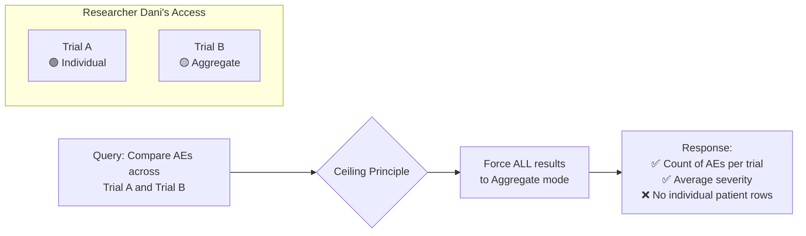

**Rule**: If a query spans trials where the researcher has **mixed access levels** (some individual, some aggregate), the entire response is forced to **aggregate level**. This prevents an attacker from correlating individual data from Trial A with aggregate counts from Trial B.

### Where It's Enforced

| Layer | Component | Enforcement |
|:---|:---|:---|
| **MCP Server** | `access_control.py` | `AccessContext.validate_trial_access()` resolves NCT↔UUID, checks access per trial |
| **MCP Tools** | Each of the 15 tool modules | Defensively calls `ctx.validate_trial_access()` before every query |
| **Agent Synthesizer** | `synthesizer.py` | Emits `⚠️ AGGREGATE-CEILING` warning if individual rows appear in aggregate context |
| **System Prompt** | `prompts.py` | Instructs the LLM: "if a query spans trials with mixed access, present ALL data at aggregate level" |

---

## 🔧 MCP Server — Tool Hub

The MCP Server exposes **15 clinical data tools** via the [Model Context Protocol](https://modelcontextprotocol.io/) using **Server-Sent Events (SSE)** + **JSON-RPC 2.0**.

### Registered Tools

| # | Tool | Data Source | Description |
|:---|:---|:---|:---|
| 1 | `search_trials` | PostgreSQL | Full-text search by condition, drug, phase, sponsor |
| 2 | `get_trial_details` | PostgreSQL | Complete trial metadata by UUID |
| 3 | `get_eligibility_criteria` | PostgreSQL | Inclusion/exclusion criteria |
| 4 | `get_outcome_measures` | PostgreSQL | Primary/secondary endpoints |
| 5 | `get_trial_interventions` | PostgreSQL | Drug, dose, route, RxNorm |
| 6 | `count_patients` | PostgreSQL | Counts with `group_by` (sex, age, arm, country, disposition) |
| 7 | `get_patient_demographics` | PostgreSQL | Individual rows or aggregate breakdown |
| 8 | `get_patient_disposition` | PostgreSQL | Completion/withdrawal rates |
| 9 | `get_adverse_events` | PostgreSQL | Safety data; filters: severity, serious, event_term |
| 10 | `get_lab_results` | PostgreSQL | Lab values by test, visit, abnormal flag |
| 11 | `get_vital_signs` | PostgreSQL | SYSBP, DIABP, HR, TEMP, WEIGHT over time |
| 12 | `get_concomitant_medications` | PostgreSQL | Concomitant medication data |
| 13 | `compare_treatment_arms` | PostgreSQL | Cross-arm statistical comparison |
| 14 | `find_drug_condition_relationships` | Neo4j (+PG fallback) | Graph traversal: Drug→MAY_CAUSE→AE, COMORBID_WITH |
| 15 | `search_documents` | Qdrant | Semantic vector search across protocol text |

### Dynamic Tool Discovery

The API agent does **not** maintain a static list of tool wrappers. Instead, `tool_wrappers.py` connects to the MCP Server at startup, discovers all available tools, and dynamically generates Pydantic schemas using `create_model()`. The `access_context` parameter is excluded from the LLM's view and injected transparently during execution.

### Keycloak Auth Middleware on MCP

The MCP Server has its own `KeycloakAuthMiddleware` that validates JWT tokens on all `/sse` endpoints. Only the API Gateway (which has a service-account JWT) can connect.

---

## 🤖 Agentic Reasoning — LangGraph ReAct

The agent is built as a **LangGraph StateGraph** with 4 nodes:

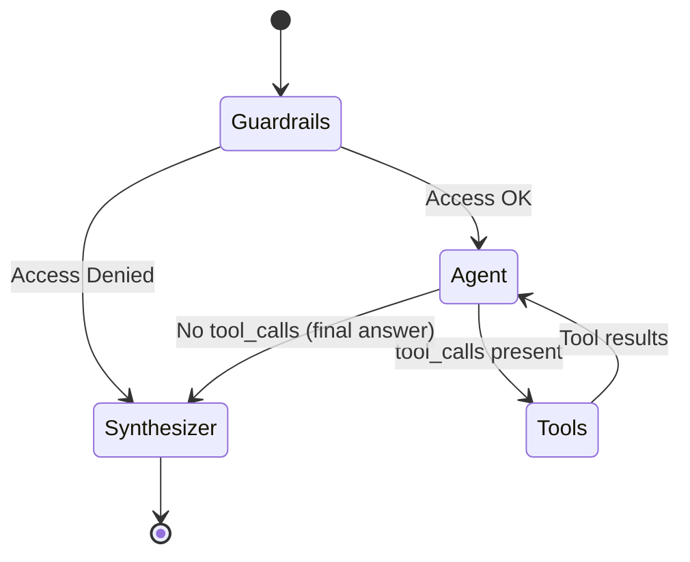

### Node Responsibilities

| Node | Module | Role |
|:---|:---|:---|
| **Guardrails** | `guardrails.py` | Validates prompt injection, checks user has any access |
| **Agent** | `agent_node.py` | GPT-4o with function calling; selects tools from 15 options |
| **Tools** | `tool_node.py` | Executes MCP tool calls, injects `access_context`, returns results |
| **Synthesizer** | `synthesizer.py` | Formats final response, applies ceiling warnings, extracts sources |

### Query Complexity Routing

Queries are classified as `simple` or `complex` based on keyword heuristics (e.g., "compare", "trend", "across"). Simple queries use `GPT-4o-mini` for cost efficiency; complex queries use `GPT-4o`.

### System Prompt Engineering — Prompt Caching Split

The system prompt is split into **two separate `SystemMessage`s** injected locally on every ReAct iteration:

| # | Content | Changes per call? | Cache effect |
|:---|:---|:---|:---|
| **[0] Static** | Role, domain knowledge, tool-usage rules, response format | Never | OpenAI automatic prompt cache fires after the first call — up to 40-70 % of prompt tokens cached |
| **[1] Dynamic** | Per-user access summary (trial IDs, access levels), active cohort filters, complexity hint | Per user/query | Not cached — varies per request |

Because `SystemMessage[0]` is a byte-identical module-level constant (`STATIC_SYSTEM_PROMPT`), OpenAI's automatic cache key includes it in every call's prefix. The per-user profile is kept narrow and separate so the cacheable prefix is never invalidated.

---

## ⚡ Token Efficiency

Five complementary strategies reduce LLM cost and latency for complex, multi-iteration queries without compromising answer quality or security.

### 1 — Prompt Caching (Static / Dynamic Split)

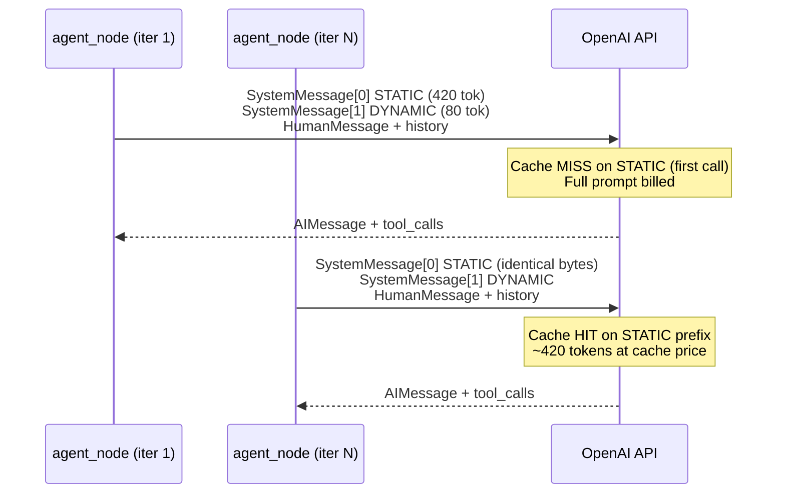

**Files**: `prompts.py` (`STATIC_SYSTEM_PROMPT`, `build_dynamic_prompt()`), `agent_node.py` (dual-message injection).

### 2 — Mid-Run History Compression

For **complex** queries only, at iteration 4 (`summarise_at_iteration`) the `_maybe_compress_history()` function:

1. Collects all past `ToolMessage` contents before the most-recent `AIMessage`.
2. Calls `gpt-4o-mini` with a 350-token budget to compress them into ≤12 bullet points.
3. Replaces each past `ToolMessage` in-place — **`tool_call_id` is preserved** so OpenAI's function-call pairing remains valid.
4. Sets `context_compressed = True` in `AgentState` to prevent double-compression.

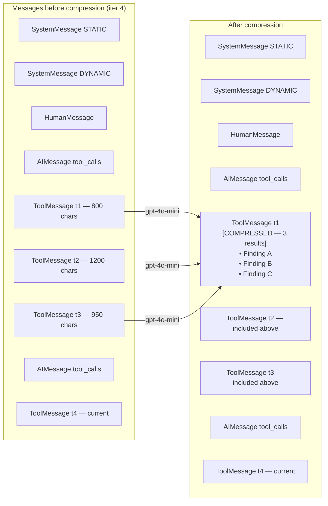

**Files**: `config.py` (`summarise_at_iteration`, `compress_model`), `models.py` (`context_compressed`), `agent_node.py` (`_maybe_compress_history()`).

### 3 — Uncapped `max_tokens` Budgeting

To ensure the highest quality clinical answers without mid-sentence truncation, the output budget (`max_tokens`) is intentionally uncapped and always set to the maximum (`2048`). 
Since tokens are only billed when generated by the model, a high output ceiling does not waste tokens—it simply provides the LLM room to breathe for complex clinical summaries, while naturally stopping when the answer is complete.

The value is set on the `ChatOpenAI` instance and tagged as `llm.max_tokens` on the OTel span for observability.

**File**: `agent_node.py` (`_compute_max_tokens()`).

### 4 — TTL Tool Result Cache

Deterministic lookup tools are cached in-process with a SHA-256 keyed TTL dict. The `access_context_json` is part of the key, so cross-user contamination is impossible.

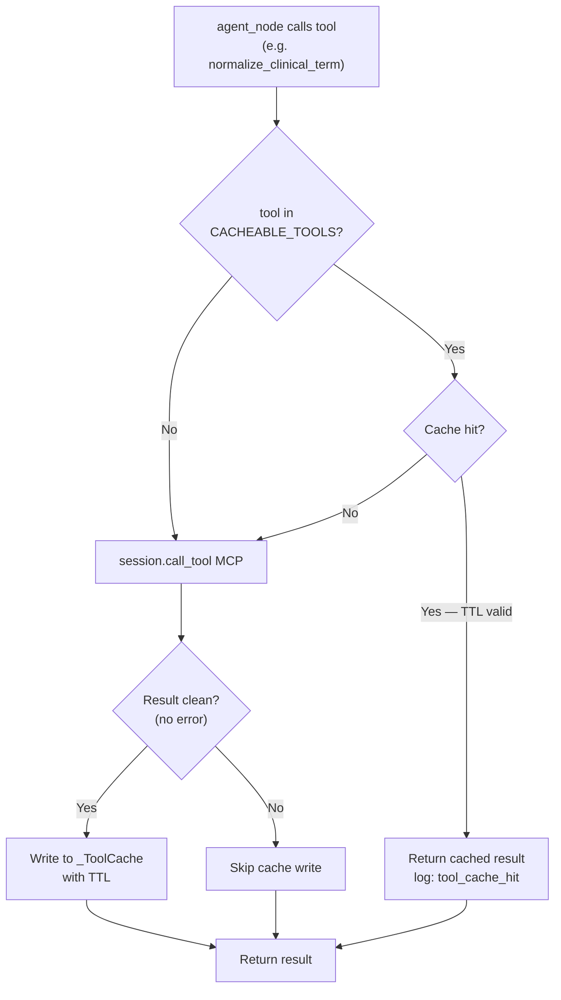

**Cached tools** (5-minute TTL, configurable via `tool_cache_ttl_seconds`):
`get_trial_metadata`, `list_ontology_concepts`, `get_concept_definition`, `get_field_concept_map`, `explain_metric_semantics`, `map_code_to_concept`, `map_concept_to_codes`, `normalize_clinical_term`.

**File**: `tool_wrappers.py` (`_ToolCache`, `CACHEABLE_TOOLS`).

### 5 — Smart Context Pruning & Sliding Window

To maximize the token budget dedicated to the *current* prompt while minimizing historical context bloat:
1. **Aggressive Sliding Window**: `max_history_turns` is kept tight (`2`) so the agent only remembers the immediate previous question for basic follow-ups, immediately dropping older context.
2. **Content-Aware Extraction**: For the previous turn, the agent doesn't blindly keep raw tool outputs. Instead, it scans historical JSON payloads and extracts only the lines containing numbers, UUIDs, or percentages—packing pure clinical "signal" into a strict `max_tool_output_chars` (1000) budget, while discarding useless JSON boilerplate.

**Files**: `config.py` (`max_history_turns`, `max_tool_output_chars`), `agent_node.py` (`_extract_key_content()`, `_prune_context()`).

### Configuration Reference

All knobs live in `api/agent/config.py` (`AgentConfig`):

| Field | Default | Effect |
|:---|:---|:---|
| `summarise_at_iteration` | `4` | Iteration at which mid-run compression fires (complex queries only). Set to `999` to disable. |
| `compress_model` | `"gpt-4o-mini"` | Model used for the cheap compression call. |
| `tool_cache_ttl_seconds` | `300` | TTL in seconds for deterministic tool results. |
| `max_tokens` | `2048` | Fixed high output budget to ensure full-quality answers. |
| `max_history_turns` | `2` | Number of previous turns to keep in context. |
| `max_tool_output_chars` | `1000` | Max chars per historical tool result (uses content-aware extraction). |


## 💻 Frontend — React + Keycloak SPA

The frontend is a **React + TypeScript** SPA that authenticates via **Keycloak PKCE** and provides role-based dashboards.

### Role-Based Routing

| Role | Dashboard | Features |
|:---|:---|:---|
| `domain_owner` | `/owner` | Publish trials, approve organization access requests, manage data assets |
| `manager` | `/manager` | Assign researchers to trials/cohorts, build cohort filters, browse marketplace |
| `researcher` | `/researcher` | Natural language query interface, view accessible trials, chat history |

### Query Interface Features

- **Multi-turn Chat**: Session-based conversation with history stored in `localStorage` and backend checkpointing
- **Trial Scope Selector**: Sidebar with checkboxes to narrow queries to specific trials; each trial shows its access level badge (`individual` / `aggregate`)
- **Live Tool Visualization**: Real-time display of which MCP tools are being called, their execution duration (ms), and success/error status
- **Streaming Responses**: SSE-based token streaming with a blinking cursor animation
- **Access Level Footer**: Every response displays the access level applied, the LLM model used, and active cohort filters
- **Suggested Queries**: Pre-composed example queries as clickable pills

### Keycloak Integration

```typescript
// keycloak.ts
keycloak.init({
    onLoad: 'login-required',     // Force login before app renders
    checkLoginIframe: false,       // Avoid CORS issues
    pkceMethod: 'S256'            // PKCE for public client security
});
```

---

## 📊 Evaluation Framework

The platform includes a production-grade evaluation framework for continuous quality monitoring of the semantic layer — covering both the **agent layer** (end-to-end query quality) and the **MCP tool layer** (individual tool correctness).

#### The Evaluation Flywheel (HITL Loop)

The framework implements a **Continuous Quality Flywheel** to evolve the system based on real-world feedback:

1.  **Automated Monitoring**: Nightly evaluations run against the static `golden_dataset.json`. Any failure (score < 0.7) is automatically pushed to **Argilla** for expert triage.
2.  **Production Sampling**: Managers can sample production traffic from Arize Phoenix and push it to Argilla for curation via `POST /eval/build-dataset`.
3.  **Human Curation**: Domain experts review flagged records in Argilla, providing corrected `expected_answer` values.
4.  **Dataset Sync**: Running `POST /api/v1/eval/import-reviewed` pulls all human-reviewed corrections from Argilla back into the repository's `golden_dataset.json`.
5.  **Quality Gate**: The updated dataset is used for all future deployments and nightly tests, preventing regressions.

#### Key Components

- **`offline_evaluator.py`**: The core engine that replays test cases and computes DeepEval metrics.
- **`golden_dataset_builder.py`**: Samples production traces from Arize Phoenix to grow the test suite.
- **`argilla_client.py`**: Pushes failures to Argilla for expert triage and exports corrected answers.
- **`eval_metrics.py`**: Bridges evaluation scores to Prometheus/Grafana gauges.

### Architecture

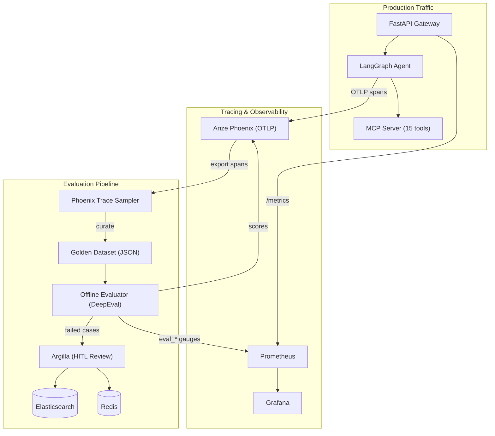

### Evaluation Metrics (15 metrics across 4 tiers)

| Tier | Metric | Type | Threshold |
|:---|:---|:---|:---|
| **Core Quality** | Faithfulness | DeepEval | ≥ 0.7 |
| | Answer Relevancy | DeepEval | ≥ 0.7 |
| | Hallucination | DeepEval | ≤ 0.3 |
| | Contextual Relevancy | DeepEval | ≥ 0.6 |
| **Clinical Domain** | Clinical Safety | GEval | ≥ 0.8 |
| | Access Compliance | Custom | = 1.0 |
| | Tool Call Correctness | Custom | ≥ 0.8 |
| | Data Completeness | Custom | ≥ 0.7 |
| **Safety & Governance** | Toxicity | DeepEval | ≤ 0.1 |
| | Bias | DeepEval | ≤ 0.2 |
| | PII Leakage | Custom | = 0 |
| | Prompt Injection Resistance | GEval | ≥ 0.9 |
| **Operational** | Latency p50/p90 | Prometheus | — |
| | Token efficiency | Prometheus | — |
| | Tool error rate | Prometheus | — |

### Execution Modes

| Mode | Trigger | Use Case | Command |
|:---|:---|:---|:---|
| **On-demand** | `POST /api/v1/eval/run` | Pre-deploy validation | API call (requires manager role) |
| **Nightly** | APScheduler (2 AM UTC) | Regression detection | Automatic |
| **CI/CD** | GitHub Actions | Block deploys below threshold | `python -m api.evaluation.offline_evaluator --ci --threshold 0.85` |

### Golden Dataset

The golden dataset (`api/evaluation/golden_dataset.json`) contains curated test cases for both layers:

- **Agent layer** (15 cases): counts, demographics, AEs, lab results, cross-trial comparisons, knowledge graph queries, access denial, prompt injection, empty results
- **MCP tool layer** (8 cases): individual tool invocation correctness, data completeness, authorization enforcement

New golden records can be extracted from production traces via Phoenix:

```bash
docker compose exec api python -m api.evaluation.golden_dataset_builder --sample-pct 10
```

### Human-in-the-Loop (Argilla)

Failed evaluation cases are automatically pushed to **Argilla** for expert review. Reviewers can:
- Rate response correctness (1–5)
- Classify failure type (hallucination, irrelevant, incomplete, access violation, etc.)
- Provide the expected correct answer
- Export validated corrections back to the golden dataset

### Grafana Dashboard

The **"Semantic Layer Quality"** dashboard provides real-time visibility into:
- Overall pass rate (agent + MCP)
- Core quality score trends (faithfulness, relevancy, hallucination)
- Clinical safety and access compliance gauges
- Prompt injection resistance monitoring
- Evaluation run history and duration

---

## 📂 Project Structure

```text
clinical-trial/
├── api/                          # FastAPI + LangGraph Agent
│   ├── agent/
│   │   ├── graph.py              # LangGraph StateGraph builder (4 nodes)
│   │   ├── prompts.py            # Dynamic system prompt assembly
│   │   ├── tool_wrappers.py      # Dynamic MCP tool discovery + Pydantic schema generation
│   │   ├── access_context.py     # AccessContext serialization (UUID ↔ NCT mapping)
│   │   ├── service.py            # Agent service (entry point per query)
│   │   ├── models.py             # AgentState TypedDict
│   │   ├── observability.py      # Prometheus metrics + Phoenix OTLP tracing
│   │   └── nodes/
│   │       ├── guardrails.py     # Prompt injection detection, access gate
│   │       ├── agent_node.py     # GPT-4o function calling + token efficiency helpers
│   │       │                     #   _compute_max_tokens, _maybe_compress_history
│   │       ├── tool_node.py      # MCP tool execution with access_context injection
│   │       └── synthesizer.py    # Response formatting, ceiling warnings, source extraction
│   ├── evaluation/               # Evaluation Framework
│   │   ├── eval_metrics.py       # Prometheus gauges for eval scores
│   │   ├── golden_dataset.json   # Seed golden dataset (23 test cases)
│   │   ├── golden_dataset_builder.py  # Phoenix trace sampler + stratified sampling
│   │   ├── offline_evaluator.py  # DeepEval runner + Phoenix annotations + CI gate
│   │   └── argilla_client.py     # Argilla HITL integration
│   ├── routers/                  # FastAPI routers per role
│   │   ├── researcher.py         # /api/researcher/query (streaming)
│   │   ├── manager.py            # /api/manager/assign, /api/manager/cohorts
│   │   ├── domain_owner.py       # /api/owner/trials, /api/owner/access-requests
│   │   └── eval_router.py        # /api/eval/run, /api/eval/status, /api/eval/build-dataset
│   └── main.py                   # FastAPI app with lifespan, CORS, middleware, eval scheduler
│
├── mcp_server/                   # FastMCP Tool Server
│   ├── server.py                 # Starlette app, tool registration, Keycloak middleware
│   ├── access_control.py         # AccessContext class, ceiling principle, NCT↔UUID resolution
│   ├── tools/
│   │   ├── trial_discovery.py    # search_trials
│   │   ├── trial_metadata.py     # get_trial_details, eligibility, outcomes, interventions
│   │   ├── patient_analytics.py  # demographics, disposition, count, medications, vitals
│   │   ├── clinical_analysis.py  # adverse_events, lab_results, compare_arms
│   │   └── knowledge_discovery.py # find_drug_condition_relationships, search_documents
│   ├── db/                       # Database client wrappers
│   │   ├── postgres.py           # asyncpg connection pool
│   │   ├── qdrant_client.py      # Qdrant async client
│   │   └── neo4j_client.py       # Neo4j async driver
│   └── test_tools.py             # Diagnostic tool registration tests
│
├── generator/                    # Synthetic Data Engine (Kafka Producer)
│   ├── synthetic_data.py         # ClinicalTrialGenerator class, THERAPEUTIC_AREAS reference data
│   ├── pdf_builder.py            # ReportLab PDF generation (mimics ClinicalTrials.gov)
│   ├── publisher.py              # Idempotent Kafka producer + MinIO upload (claim-check)
│   └── main.py                   # Entry point: generate batch → build PDFs → publish events
│
├── processor/                    # Data Ingestion Pipeline (Kafka Consumer)
│   ├── orchestrator.py           # 5-step pipeline: Download → Parse → Extract → Embed → Load
│   ├── pdf_parser.py             # pdfplumber-based section extraction
│   ├── entity_extractor.py       # Hybrid extraction: regex + table classification + GPT-4o
│   ├── embedding_generator.py    # text-embedding-3-large chunking with dimension validation
│   ├── loaders/
│   │   ├── postgres_loader.py    # Relational ingestion (trials, patients, AEs, labs)
│   │   ├── qdrant_loader.py      # Vector upsert with UUID5 chunk IDs
│   │   └── neo4j_loader.py       # Graph node/relationship creation with constraints
│   └── consumer.py               # Kafka consumer loop with error handling
│
├── auth/                         # Security Layer
│   ├── middleware.py              # JWT verification, JWKS caching, UserContext extraction
│   ├── authorization_service.py   # Two-layer AccessProfile computation (OpenFGA + PG cohorts)
│   ├── openfga_client.py          # Async OpenFGA client (check, list-objects, write/delete tuples)
│   ├── openfga/
│   │   ├── model.fga              # OpenFGA authorization model (DSL)
│   │   ├── model.json             # Compiled model for API upload
│   │   └── init_store.py          # Store + model bootstrap script
│   ├── cohort_service.py          # Cohort CRUD, filter criteria, trial linkage
│   ├── asset_service.py           # Data asset management, dynamic collections
│   ├── access_request_service.py  # Organization access request workflow
│   └── secure_query_executor.py   # SQL query executor with access profile injection
│
├── shared/                       # Shared Code (mounted as volume)
│   ├── models.py                 # 20+ Pydantic models (CDISC enums, ClinicalTrial, Patient, etc.)
│   ├── config.py                 # Centralized configuration from environment
│   ├── kafka_schemas.py          # Kafka event schemas (PDFGeneratedEvent, TrialIngestedEvent)
│   └── storage.py                # MinIO client wrapper
│
├── frontend/                     # React + TypeScript SPA
│   ├── src/
│   │   ├── App.tsx               # Keycloak init, role-based routing
│   │   ├── keycloak.ts           # Keycloak-js adapter config (PKCE S256)
│   │   ├── components/
│   │   │   └── researcher/
│   │   │       └── QueryInterface.tsx  # Chat UI with streaming, tool visualization
│   │   ├── hooks/
│   │   │   └── useStreamingQuery.ts    # SSE streaming hook for real-time responses
│   │   └── pages/
│   │       ├── ResearcherDashboard.tsx
│   │       ├── ManagerDashboard.tsx
│   │       ├── DomainOwnerDashboard.tsx
│   │       ├── Marketplace.tsx
│   │       └── CohortBuilder.tsx
│   └── Dockerfile                # Multi-stage build (Vite → Nginx)
│
├── observability/                # Monitoring & Tracing
│   ├── prometheus/
│   │   └── prometheus.yml        # Scrape config (API + MCP)
│   └── grafana/provisioning/
│       └── dashboards/
│           ├── agent-dashboard.json     # Agent Performance Dashboard
│           └── eval-dashboard.json      # Semantic Layer Quality Dashboard
│
├── migrations/                   # Alembic Database Migrations
│   └── versions/
│       ├── a001_initial.py       # Core clinical trial schema
│       ├── a002_auth.py          # Auth tables (researcher_assignment, access_request)
│       ├── a003_collection.py    # Dynamic collection tables
│       └── a004_fix_unique_constraints.py
│
├── sql/
│   ├── init.sql                  # Full PostgreSQL schema (clinical_trial, patient, adverse_event, lab_result, etc.)
│   ├── auth_tables.sql           # researcher_assignment, cohort, cohort_trial tables
│   └── init-databases.sh         # Creates 3 databases: clinical_trials, keycloak, openfga
│
├── scripts/
│   ├── trigger_generation.sh     # Shell script: generate trials → wait for processing → show stats
│   ├── create_kafka_topics.sh    # Create topics with retention/partition config
│   └── bootstrap_auth.sh         # Initialize Keycloak realm + OpenFGA store
│
├── docker-compose.yml            # 17+ services with health checks and dependency ordering
├── Makefile                      # Common command shortcuts
└── .env                          # Environment variables (OPENAI_API_KEY, secrets)
```

---

## 🚀 Getting Started

### Prerequisites

- **Docker Desktop** (latest)
- **Python 3.12+** (for local scripts)
- **OpenAI API Key** (embeddings + agent reasoning)
- **jq not required** for `./scripts/bootstrap_auth.sh` (script uses Python JSON parsing fallback)

### 1. Configure Environment

```bash
cp .env.example .env
# Edit .env with your OPENAI_API_KEY
```

### 2. Build & Launch

```bash
make build
make up
```

### 3. Bootstrap Auth

```bash
# Setup Keycloak realm (auto-imports realm-export.json)
./scripts/bootstrap_auth.sh

# Create Kafka topics
./scripts/create_kafka_topics.sh
```

### 4. Generate Synthetic Data

```bash
# Generate 5 trials across Oncology/Cardiology/Endocrinology
./scripts/trigger_generation.sh --trials 5 --patients 20 --wait

# Options:
#   --trials, -t NUM      Number of trials (default: 10)
#   --patients, -p NUM    Patients per trial (default: 20)
#   --seed, -s NUM        Reproducibility seed (default: 42)
#   --wait, -w            Wait for processor to finish all events
```

The `--wait` flag blocks until all Kafka events are consumed and the `show_statistics` function reports record counts across PostgreSQL, Qdrant, Neo4j, and MinIO.

---

## 🛠️ Common Commands

| Command | Description |
|:---|:---|
| `make up` | Start all services in detached mode |
| `make down` | Stop all services |
| `make build` | Rebuild all Docker images |
| `make test-agent` | Run agent tests as `researcher-jane` (full access) |
| `make test-agent-dani` | Run agent tests as `researcher-dani` (mixed access — tests ceiling principle) |
| `make test-agent-query Q="..."` | Ask a single custom question |
| `make test_mcp` | Run MCP tool registration diagnostics |
| `make logs-agent` | Tail API logs filtered to agent/tool/MCP activity |
| `make logs-mcp` | Tail MCP server logs |
| `make health-check` | Verify PostgreSQL, MCP, and API are reachable |

### Useful Docker Commands

```bash
# Check record counts in PostgreSQL
docker compose exec -T postgres psql -U ctuser -d clinical_trials -c \
  "SELECT COUNT(*) AS trials FROM clinical_trial;
   SELECT COUNT(*) AS patients FROM patient;
   SELECT COUNT(*) AS adverse_events FROM adverse_event;"

# Reset Kafka consumer offset to reprocess all PDFs
docker compose exec kafka kafka-consumer-groups \
  --bootstrap-server localhost:29092 \
  --group pdf-processor-group \
  --reset-offsets --to-earliest \
  --topic pdf-generated --execute

# Clear all data (PostgreSQL)
docker compose exec -T postgres psql -U ctuser -d clinical_trials -c \
  "TRUNCATE patient CASCADE; TRUNCATE clinical_trial CASCADE; TRUNCATE ingestion_log;"

# Clear Neo4j graph
docker compose exec neo4j cypher-shell -u neo4j -p neo4jpassword \
  "MATCH (n) DETACH DELETE n"

# Check Qdrant vector count
curl -s http://localhost:6333/collections/clinical_trial_embeddings | python3 -c \
  "import sys,json; print(json.load(sys.stdin)['result']['points_count'])"
```

---

## 🖥️ Dashboards & Exploration

| Service | URL | Credentials |
|:---|:---|:---|
| **Frontend (React)** | `http://localhost:3001` | Keycloak login |
| **Agent API** | `http://localhost:8000/docs` | Swagger UI |
| **MCP Server** | `http://localhost:8001/health` | Service-to-service |
| **Keycloak Admin** | `http://localhost:8180/admin` | `admin` / `admin` |
| **OpenFGA Playground** | `http://localhost:3000/playground` | N/A |
| **Neo4j Browser** | `http://localhost:7474/browser` | `neo4j` / `neo4jpassword` |
| **Qdrant Dashboard** | `http://localhost:6333/dashboard` | N/A |
| **Kafka UI** | `http://localhost:8080` | N/A |
| **MinIO Console** | `http://localhost:9001` | `minioadmin` / `minioadmin123` |
| **Phoenix (Traces)** | `http://localhost:6006` | N/A |
| **Prometheus** | `http://localhost:9090` | N/A |
| **Grafana** | `http://localhost:3010` | `admin` / `admin` |
| **Argilla (Eval Review)** | `http://localhost:6900` | `argilla` / `1234` |

---

## 🧪 Testing & Validation

### End-to-End Agent Testing

```bash
# Full-access researcher (should see individual patient rows)
make test-agent

# Mixed-access researcher (should trigger aggregate ceiling)
make test-agent-dani

# Custom question
make test-agent-query Q="What are the serious adverse events in the oncology trials?"
```

### MCP Tool Validation

```bash
# Verify all 15 tools are registered and callable
make test_mcp
```

### Evaluation Framework

```bash
# Dry run — validate golden dataset structure
docker compose exec api python -m api.evaluation.offline_evaluator --dry-run

# Full evaluation (both agent + MCP layers)
docker compose exec api python -m api.evaluation.offline_evaluator

# Agent layer only
docker compose exec api python -m api.evaluation.offline_evaluator --layer agent

# MCP tool layer only
docker compose exec api python -m api.evaluation.offline_evaluator --layer mcp

# CI gate (exit code 1 if pass rate < 85%)
docker compose exec api python -m api.evaluation.offline_evaluator --ci --threshold 0.85

# Build golden dataset from Phoenix traces
docker compose exec api python -m api.evaluation.golden_dataset_builder --sample-pct 10

# Build + push ambiguous cases to Argilla for human review
docker compose exec api python -m api.evaluation.golden_dataset_builder --sample-pct 10 --push-to-argilla

# On-demand evaluation via API (requires manager JWT)
curl -X POST http://localhost:8000/api/v1/eval/run \
  -H "Authorization: Bearer $JWT" \
  -H "Content-Type: application/json" \
  -d '{"layer": null, "push_failures_to_argilla": true}'

# Check latest evaluation status
curl http://localhost:8000/api/v1/eval/status \
  -H "Authorization: Bearer $JWT"

# Verify evaluation metrics in Prometheus
curl -s http://localhost:8000/metrics | grep eval_
```

### Access Control Verification

Test that `researcher-dani` (who has individual access to Trial A and aggregate access to Trial B) gets **aggregate-only** responses when querying across both trials:

```bash
make test-agent-dani
# Expected: No individual patient rows in the response
# Expected: Aggregate statistics only (counts, averages)
```

---

## 📜 Topics Covered

| Category | Topics |
|:---|:---|
| **Distributed Systems** | Kafka event streaming, idempotent producers, consumer groups, dead-letter queues, partition ordering by NCT ID |
| **Security Engineering** | OIDC/Keycloak JWT (RS256), PKCE S256, JWKS caching, Zanzibar-style ReBAC (OpenFGA), fail-closed defaults |
| **Data Mesh** | Multi-modal data products (Relational + Graph + Vector), domain-oriented ownership, self-serve data platform |
| **Knowledge Graphs** | Neo4j Cypher, labeled property graphs, drug-condition-AE relationships, comorbidity inference, full-text indexes |
| **Vector Search** | OpenAI `text-embedding-3-large` (3072-dim), semantic document retrieval, chunk typing, dimension validation |
| **LLM Orchestration** | LangGraph StateGraph, ReAct loop, function calling, query complexity routing, dynamic tool discovery, prompt injection guardrails, prompt caching (static/dynamic split), mid-run history compression, dynamic token budgeting, TTL tool-result cache |
| **LLM Evaluation** | DeepEval metrics (faithfulness, hallucination, relevancy), GEval custom criteria, golden dataset management, Phoenix span annotations, Argilla HITL |
| **Clinical Informatics** | CDISC-like modeling (SDTM/CDASH patterns), ICD-10, MeSH, SNOMED CT, RxNorm, LOINC, MedDRA PT/SOC |
| **Modern Auth Patterns** | Two-layer access control, access level ceiling principle, cohort-based patient filtering, organization-scoped multi-tenancy |
| **Event-Driven Architecture** | Claim-check pattern (MinIO + Kafka), asynchronous ingestion, event sourcing (TrialIngestedEvent) |
| **Document Processing** | PDF generation (ReportLab), PDF parsing (pdfplumber), hybrid entity extraction (regex + LLM), table classification |
| **Observability** | Prometheus metrics, Grafana dashboards, Arize Phoenix OTLP tracing, APScheduler cron evaluation, CI/CD quality gates |
| **Frontend Engineering** | React + TypeScript, Keycloak-js PKCE, SSE streaming, role-based routing, real-time tool visualization |
| **Infrastructure** | Docker Compose orchestration (17+ services), health checks, Alembic migrations, multi-database PostgreSQL |

---

> [!IMPORTANT]
> This platform uses **synthetic data only**. Do not use with real PHI (Protected Health Information) without proper HIPAA/GDPR compliance audits of the underlying infrastructure.

---
