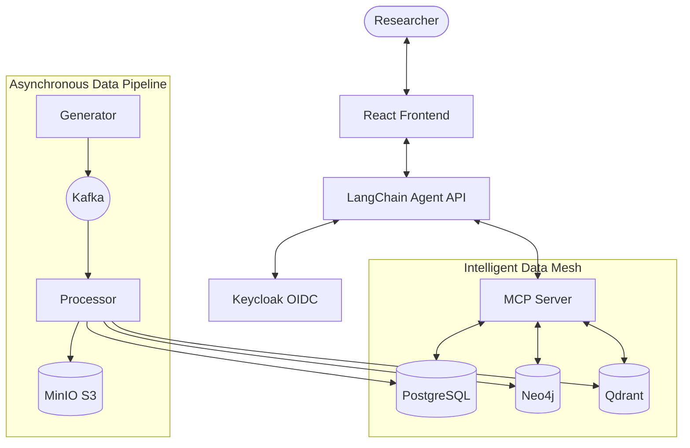

# Clinical Trial MCP Platform 🧬

[](https://opensource.org/licenses/MIT)
[](https://www.python.org/downloads/release/python-3120/)
[](https://fastapi.tiangolo.com/)
[](https://modelcontextprotocol.io/)

A secure, agentic platform for clinical trial data analysis, leveraging the **Model Context Protocol (MCP)** to bridge Large Language Models with multi-modal clinical data (Relational, Graph, Vector). This project implements a full-stack data mesh architecture designed for high-security clinical research environments.

## 🌟 Key Features

- **Secure MCP Server**: A centralized tool hub with dynamic tool discovery and JWT-based authorization.
- **Agentic Reasoning**: A LangChain-powered ReAct agent capable of complex cross-trial analysis and patient-level querying.
- **Multi-modal Data Mesh**:
    - **PostgreSQL**: Stores structured patient records, lab results, and trial metadata.
    - **Neo4j**: Maps the knowledge graph of trial sections, drug-condition relationships, and NCT hierarchies.
    - **Qdrant**: High-performance vector database for semantic search across clinical study reports (PDFs).
- **Automated Ingestion Pipeline**: Kafka-driven processing of clinical documents, including OCR, NER (Named Entity Recognition), and embedding generation.
- **Privacy-First Access Control**: Implementation of the "Access Level Ceiling" principle, ensuring that individual patient data is never leaked in aggregate contexts.

---

## 🏗️ Architecture

The platform follows a microservices architecture coordinated via Docker Compose.



---

## 🚀 Getting Started

### Prerequisites

- **Docker Desktop** (latest version)
- **Python 3.12+** (for local scripts/tests)
- **OpenAI API Key** (required for embeddings and agent reasoning)

### 1. Environment Configuration

Copy the example environment file and fill in your credentials:

```bash
cp .env.example .env
# Edit .env with your OPENAI_API_KEY and other settings
```

### 2. Launch Infrastructure

Start the entire stack using the Makefile:

```bash
make build
make up
```

### 3. Bootstrap Services

Initialize the authentication realm and Kafka topics:

```bash
# Setup Keycloak realms and clients
./scripts/bootstrap_auth.sh

# Create required Kafka topics
./scripts/create_kafka_topics.sh
```

---

## 📊 Data Generation & Ingestion

The platform includes a sophisticated synthetic data generator that creates realistic clinical trials, patients, and clinical documents.

### Trigger Synthetic Data Generation

```bash
# Generate 5 trials with 20 patients each and their corresponding PDF reports
./scripts/trigger_generation.sh --trials 5 --patients 20 --wait
```

The `--wait` flag ensures the script stays active until the **Processor** has finished ingesting all records into the data mesh. Once complete, it will display a summary table of records across all databases.

---

## 🖥️ Dashboards & Exploration

| Service | Component | URL | Credentials |
| :--- | :--- | :--- | :--- |
| **Agent API** | Agentic Logic | `http://localhost:8000` | N/A |
| **MCP Server** | Tool Hub | `http://localhost:8001` | Bearer Auth |
| **MinIO** | S3 Storage (PDFs) | `http://localhost:9001` | `minioadmin` / `minioadmin123` |
| **Neo4j** | Knowledge Graph | `http://localhost:7474` | `neo4j` / `neo4jpassword` |
| **Qdrant** | Vector Search | `http://localhost:6333/dashboard` | N/A |
| **Keycloak** | Identity Provider | `http://localhost:8080` | `admin` / `admin` |

---

## 🛠️ Common Commands

| Command | Description |
| :--- | :--- |
| `make up` | Start all services in detached mode |
| `make down` | Stop all services and remove containers |
| `make build` | Rebuild all Docker images |
| `make logs-agent` | Tail logs related to the Agent and MCP server |
| `make health-check`| Verify connectivity to PG, MCP, and API |
| `make test_mcp` | Run diagnostic tests on MCP tool registration |

---

## 🧪 Testing & Validation

### Testing the Agent Logic

The agent identifies the user and applies access control rules dynamically.

```bash
# Run a standard test script as Researcher Jane (Full Access)
make test-agent

# Run a test as Researcher Dani (Limited/Mixed Access)
# This verifies the "Aggregate Ceiling" where individual data is scrubbed
make test-agent-dani

# Ask a custom clinical question
make test-agent-query Q="Summarize the primary endpoints of the Leukemia trial"
```

### Validating Tools Directly

You can execute the MCP tools directly within the container for debugging:

```bash
docker compose exec mcp-server python -m test_tools
```

---

## 🔐 Security & Compliance

### Access Level Ceiling Principle
The platform enforces a unique security model:
- **Individual Access**: Researcher can see raw patient rows and specific identifiers.
- **Aggregate Access**: Researcher can only see statistical summaries (averages, counts).
- **Mixed Queries**: If a query touches multiple trials where the researcher has different access levels, the system **defaults to Aggregate level** for the entire response to prevent lateral data leakage.

### ID Resolution Guardrails
To prevent LLM hallucinations, the platform performs **Contextual ID Resolution**:
- Maps user-provided NCT IDs (e.g., `NCT0456...`) to internal database UUIDs.
- Validates that the requested ID exists and the user has permission *before* executing database queries.

---

## 📂 Project Structure

```text
clinical-trial/
├── api/                # LangChain Agent API (FastAPI)
├── mcp_server/         # MCP Server (FastMCP) with clinical tools
│   └── tools/          # Discrete tool implementations (Analytics, Metadata, Graph)
├── generator/          # Synthetic data engine (Kafka Producer)
├── processor/          # Data ingestion & ML pipeline (Kafka Consumer)
├── shared/             # Common models, schemas, and config
├── frontend/           # React/Vite UI
├── auth/               # Keycloak themes and configuration
├── scripts/            # Infrastructure bootstrap scripts
└── sql/                # PostgreSQL schema definitions
```

---

## 📜 Topics Covered

- **Distributed Systems**: Kafka-based message passing for asynchronous data processing.
- **Security Engineering**: OIDC/Keycloak integration, JWT validation, and RBAC (Role-Based Access Control).
- **Knowledge Graphs**: RAG (Retrieval-Augmented Generation) combined with Neo4j graph traversal.
- **Vector Search**: Semantic document retrieval using Qdrant and OpenAI embeddings.
- **LLM Orchestration**: Agentic workflows with LangChain, ReAct loops, and dynamic tool schemas.
- **Clinical Informatics**: Modeling trials using CDISC-like patterns (Adverse Events, Lab Results, Endpoints).

---

> [!IMPORTANT]
> This platform is for **demonstration and research purposes only**. Do not use with real PHI (Protected Health Information) without proper HIPAA/GDPR compliance audits of the underlying infrastructure.