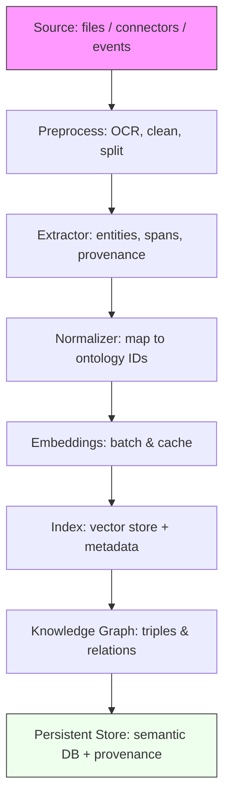
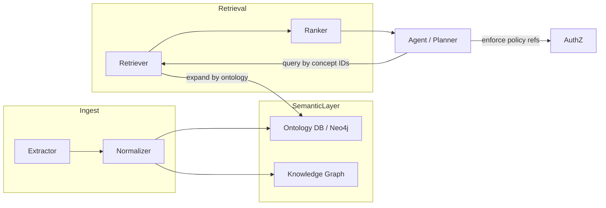
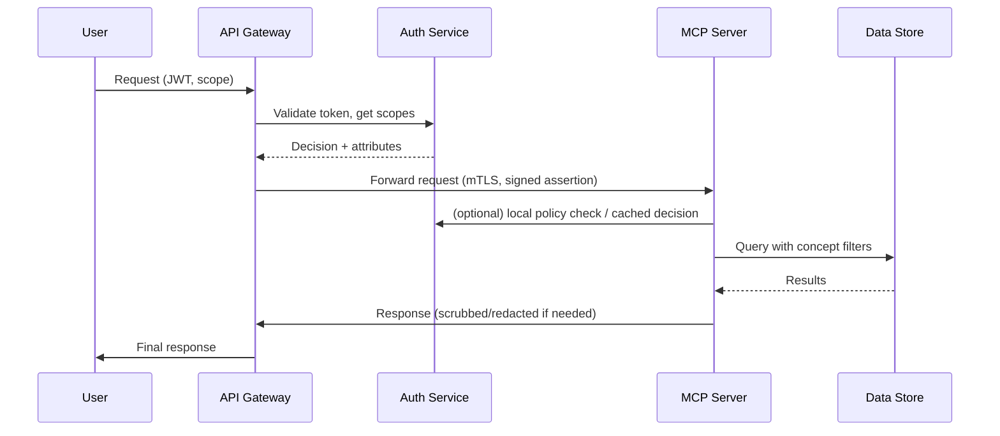

# Presentation Script — Clinical-trial AI Platform

> Speaker: [Your name] — Goal: present architecture, semantic/ontology layer,
> ingestion, fine-grained access control, MCP server security, and filters.

Estimated length: 12–18 minutes (speak clearly; use slides or demo snippets).

## 1 — Opening (30s)

- "Hi — I'm [Name]. I'll walk through our clinical-trial AI platform: its
  architecture, ingestion and semantic/ontology layer, fine‑grained access
  control, and how we secure MCP servers and filter data."

## 2 — One-line summary (20s)

- "This platform ingests clinical documents, extracts structured entities,
  stores semantically-indexed knowledge, and serves access-controlled,
  explainable answers via agentic services."

## 3 — High-level architecture (1m)

- Key components and code pointers:
  - Ingestion & processors: `processor/` (`pdf_parser.py`, `entity_extractor.py`).
  - Embedding & storage: `processor/embedding_generator.py`, `agent/embedding_cache.py`.
  - Semantic & ontology layer: `semantic_mcp_server/ontology.py`,
    `semantic_mcp_server/neo4j_ontology.py`.
  - API & agents: `api/main.py`, `agent/service.py`, `mcp_server/server.py`.
  - Auth & access: `auth/` (e.g., `auth/openfga_client.py`, `authorization_service.py`).
  - Observability: `observability/`, `api/metrics.py`.

## 4 — Ingestion pipeline (2m)

- Flow summary:
  1. Source ingestion: connectors or uploads feed ETL workers.
  2. Preprocessing: `pdf_parser.py` cleans, OCRs, and splits documents.
  3. Extraction: `entity_extractor.py` pulls structured data and provenance.
  4. Embeddings & indexing: `embedding_generator.py` creates embeddings (batched)
     and caches them in `agent/embedding_cache.py` before persisting to vector store.
  5. Semantic normalization: map entities to canonical ontology IDs via
     `semantic_mcp_server/ontology.py`.
  6. Persist: store semantic triples/records with provenance and dataset tags.

- Why it matters: early normalization + provenance enable reliable retrieval,
  policy enforcement, and traceable evidence for answers.

## 5 — Semantic & Ontology Layer (3.5m)

- Role & objectives:
  - Provide canonical concepts, synonyms, type hierarchies, and relations
    (drugs, cohorts, endpoints, etc.).
  - Support semantic search, concept-level policy, query expansion, and
    evidence tracing.

- Implementation notes:
  - Ontology store and mappings live in `semantic_mcp_server/ontology.py`.
  - For traversal and scale use a graph DB (we already have
    `semantic_mcp_server/neo4j_ontology.py`).
  - Ingestion maps extracted entities to canonical ontology URIs and stores
    those with provenance metadata.
  - Retriever uses ontology-aware query expansion (synonyms, parent concepts)
    to control recall and precision.
  - Knowledge graph relations power inference and provide transparent
    evidence traces for generated answers.

- How it supports agents:
  - Agents and planners operate over concept IDs instead of raw strings —
    reduces hallucination, simplifies policy checks, and enables precise
    filtering.

- Tradeoffs:
  - Doing it: stronger recall, explainability, governance, and precise
    policy targeting.
  - Not doing it: faster prototyping but brittle QA, more hallucinations,
    and coarse access controls.

## 6 — Fine-grained Access Control (3m)

- Policy model:
  - Use relationship-aware policies + ABAC/RBAC (OpenFGA-like). See
    `auth/openfga_client.py` and `auth/authorization_service.py`.

- What to control:
  - Resources: raw documents, semantic concepts, KG nodes, derived answers.
  - Actions: read, search, retrieve evidence, export.
  - Context: user role, organization, purpose, consent, time, residency.

- Who defines policies:
  - Data owners/data stewards: business rules and sensitivity labels.
  - Security/privacy: enforcement stance.
  - Platform engineers: policy templates and runtime enforcement.
  - Product/compliance: approve exceptions.

- How to set policies (practical flow):
  1. Tag data at ingestion with taxonomy/sensitivity.
  2. Store policies in a central policy store (OpenFGA/OPA or platform service).
  3. Author policies via policy-as-code in a repo with PRs and approvals.
  4. Expose a simple UI or CLI for stewards to manage policies.

- Enforcement points & mechanisms:
  - PEPs at the API gateway (`api/`), MCP servers (`mcp_server/`), and agents.
  - Policy decisions via central auth service or cached local OPA for low latency.
  - Types of enforcement:
    - Row-level filters: rewrite or filter retrieval queries.
    - Concept-level filtering: remove results tied to restricted ontology nodes.
    - Response scrubbing: `agent/response_scrubber.py` to redact disallowed outputs.

- Auditing & delegation:
  - Log every authorization decision with context and model version.
  - Provide scoped admin/delegate roles and history for changes.

## 7 — Securing & Authorizing MCP servers (2m)

- Threats: unauthorized access, lateral movement, data exfiltration,
  and model abuse.

- Authentication & transport:
  - Use mutual TLS for service-to-service authentication and platform PKI
    for short-lived certs.
  - Use OAuth2/JWT for user requests; validate scopes and intents at MCP.

- Authorization & filters:
  - MCP servers call the central authorization service or consult a cached
    policy engine to obtain decisions.
  - Use signed tokens that include resource context and intended purpose.

- Hardening & runtime controls:
  - Least-privilege service accounts, rate limits, quotas, signed images,
    image scanning, and secrets in vaults.
  - Keep policy evaluation and filtering close to the data to avoid leaks.

## 8 — Observability, Auditing & Compliance (40s)

- Metrics and logs to capture:
  - Request traces, latency (p50/p95/p99), token costs, model version,
    retriever recall, policy-deny counts, and auth decisions.
  - Use `observability/` and `api/metrics.py` and build Grafana dashboards.

## 9 — Operational playbook (40s)

- Incident steps:
  1. Identify model + retriever snapshot and auth decisions.
  2. Roll back model or disable endpoint.
  3. Quarantine suspect data and begin root-cause analysis.
  4. Add or update policies and tests to prevent recurrence.

## 10 — Roadmap & Tradeoffs (50s)

- Immediate (low-effort/high-impact):
  - Add concept-level policy tests, ensure ingestion tags sensitivity,
    enforce PEPs at MCP servers.

- Mid-term:
  - Model registry, canary deployments, and nightly evaluation runs.

- Long-term:
  - Drift detection, automated retraining triggers, and richer HITL flows.

- Tradeoff recap: investing in semantic/ontology and access control increases
  engineering cost but reduces risk, hallucinations, and compliance exposure.

## 11 — Closing & Asks (20s)

- Decisions requested:
  - Approve policy store choice (OpenFGA vs OPA).
  - Timeline for concept-level filters on retrievers.
  - Owner for policy authoring UI and data stewardship.

## Demo & Slide suggestions

- Slides: architecture diagram, ingestion flow, ontology sample graph,
  policy flow (author → store → enforcement), security checklist.
- Demo idea: show a query before/after ontology mapping and policy filtering,
  and trace an auth decision in logs.

---

If you want, I can convert this to a 6-slide deck or add example
OpenFGA/OPA policy snippets and JWT claim examples.

## Workflow diagrams

Below are compact workflow diagrams to include in slides or docs. They
illustrate ingestion, the semantic/ontology interactions, access-control
decision flow, and MCP server security sequence.

### Ingestion pipeline



### Semantic & ontology interactions



### Access control decision flow

```mermaid
flowchart TD
  User --> API[API Gateway / PEP]
  API --> Auth[AuthZ Service (OpenFGA / OPA)]
  Auth -->|allow/deny + constraints| API
  API -->|apply filters| Retriever
  Retriever --> Data[Vector Store / KG]
  Data --> API
  API --> Scrubber[Response Scrubber]
  Scrubber --> User
```

### MCP server security & auth sequence



